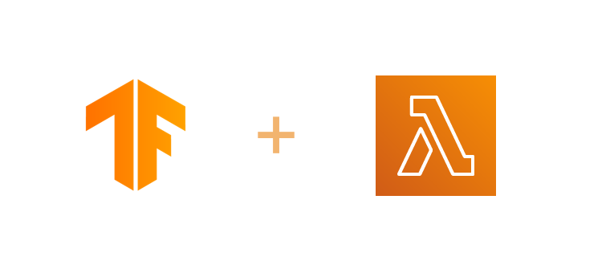

# tensorflow-lambda

<div align="center">

</div>

## Usage

First, install the package:

```
yarn add tensorflow-lambda
```

You can then use it like this:

```js
const loadTf = require('tensorflow-lambda')

const tf = await loadTf()

// you get the same `tf` object that would get if you were doing:
// const tf = require('@tensorflow/tfjs')

tf.tensor([1, 2, 3, 4]).print()
```

Have a look at these examples :

- [object-detection](https://github.com/lucleray/object-detection) (deployed with Zeit Now)

## Local usage

When not used in a lambda environment (for example, locally on your computer when you're developing), `tensorflow-lambda` will require `@tensorflow/tfjs-node` instead of deflating a pre-compiled version in `/tmp`.

Therefore, you need to install `@tensorflow/tfjs-node` to use this package locally:

```
yarn add @tensorflow/tfjs-node --dev
```

You can then use the package the same way you would use it in a lambda environment locally.

Have a look at [these lines](https://github.com/lucleray/tensorflow-lambda/blob/c056a3959c117d40cc69a1e76572c856b5d23cd6/index.js#L10-L16) to understand how it detects if it runs in a lambda environement.

## How it works ?

The package contains a zipped and compressed version of all the dependencies and binaries needed to run `@tensorflow/tfjs-node` on AWS Lambda (these dependencies are built with Github Actions).

During cold start, the files are deflated in `/tmp` and required in your node program.

## Motivation

`@tensorflow/tfjs` works with AWS Lambda but the main problem is that it is slow very slow when used in node. On the other hand, `@tensorflow/tfjs-node` is fast when used with node but it is >140mo and it does not fit under AWS Lambda's size limit (50mo) and it needs to be pre-compiled for lambda for it to work in a lambda environment.

I was looking for an easy way to use tensorflowjs with lambda and I couldn't find any, so I made this package.
